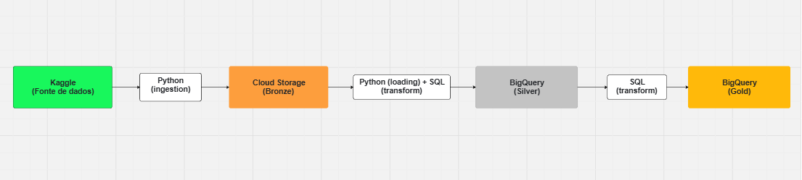
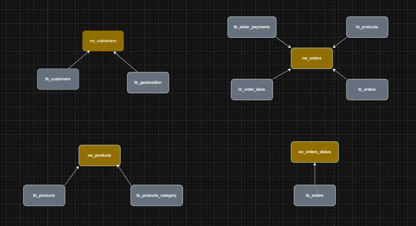

# 📌 Descrição

Este projeto tem como objetivo construir uma arquitetura de dados completa utilizando a abordagem **Medallion Architecture (Bronze, Silver e Gold)** na Google Cloud Platform.

O pipeline realiza a ingestão de dados de um dataset do Kaggle, armazenando os dados brutos no Cloud Storage, transformando-os no BigQuery e disponibilizando-os em uma camada analítica pronta para consumo em BI.

O projeto foi desenvolvido com foco em **eficiência de custo**, utilizando serviços gerenciados do GCP e evitando componentes desnecessários para um cenário inicial.

---

## 🧱 Arquitetura

### 🔄 Fluxo de dados

Kaggle → Python (Ingestion) → Cloud Storage (Bronze)  
→ Python (Load) + SQL(transformation) → BigQuery (Silver - Tables)  
→ SQL (Transformations) → BigQuery (Gold - Views)   

---

# 🏗️ Camadas da Arquitetura

### 🟫 Bronze 

- Armazenamento: Google Cloud Storage  
- Formato: CSV (sem tratamento)  
- Fonte: Kaggle API via Python  

📌 Responsabilidade:
- Armazenar dados brutos sem transformação

---

### 🟦 Silver 

- Ferramenta: BigQuery (tabelas) 
- Tabelas estruturadas a partir dos CSVs  

📌 Processos:
- Ingestão com Python (`load_table_from_uri`)  
- Limpeza de dados com SQL  
  - Remoção de espaços (`TRIM`)  
  - Tratamento de nulos  
  - Padronização de dados  

---

### 🟨 Gold 

- Ferramenta: BigQuery (Views)  

📌 Aplicações:
- Regras de negócio  
- Preparação para BI  
- Modelagem analítica  

---

## 🧩 Modelo de Dados

### 🔑 Views criadas

- `vw_orders` → tabela fato (vendas)  
- `vw_customers` → dimensão de clientes  
- `vw_products` → dimensão de produtos  
- `vw_orders_status` → dados operacionais/logísticos  

---

### 🔗 Relacionamentos

- `vw_orders_fact.customer_id → vw_customers_dim.customer_id`  
- `vw_orders_fact.product_id → vw_products_dim.product_id`  
- `vw_orders_fact.order_id → vw_orders_status.order_id`  

---

## ⚙️ Tecnologias Utilizadas

- Python  
- Google Cloud Platform  
  - Cloud Storage  
  - BigQuery  
- SQL  
- Kaggle API  
- Power BI  

---

## 🔁 Pipeline de Dados

### ✅ Ingestão

- Conexão com Kaggle via Python  
- Download dos dados  
- Upload para o Cloud Storage  

---

### ✅ Carga (Load)

- Script Python responsável por:  
  - Ler arquivos do bucket  
  - Carregar dados no BigQuery (Silver)  

---

### ✅ Transformação

- Tratamento com SQL:  
  - Limpeza  
  - Padronização  
  - Tratamento de nulos  

---

### ✅ Camada Analítica

- Criação de views com regras de negócio  
- Dados preparados para análise no Power BI  

---

## 📦 Estrutura do Projeto

├── scripts/  
│   ├── ingestion/  
│   └── loading/  
│  
├── sql/  
│   ├── silver/  
│   └── gold/  
│  
├── docs/  
│   ├── arquitetura.png  
│   ├── modelo_dados.png  
│  
├── requirements.txt  
└── README.md  

---

## 📋 Requisitos

Instalação:

pip install -r requirements.txt

Conteúdo:

google-cloud-bigquery  
google-cloud-storage  
kaggle  

---

## 📊 Objetivo Final

Disponibilizar dados prontos para análise, permitindo:

- análise de vendas  
- análise de clientes  
- análise de produtos  
- monitoramento logístico  
